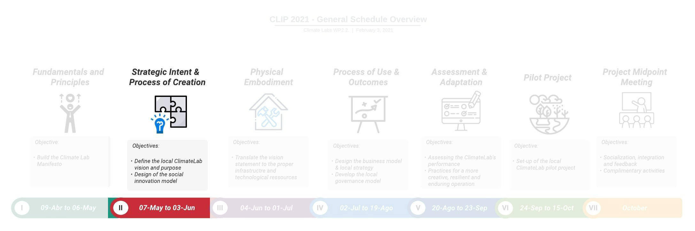

# Strategic Intent & Process of Creation {#sprint_2}

## Sprint Opening


```{r}

```


Welcome to the second sprint of the CLIP. In this sprint we are going to
focus on the **Strategic Intent & Process of Creation** for the Climate
Labs.

::: {.infobox .goal data-latex="{.goal}"}
**GOAL**

This second sprint has two main goals:

> First, to define your **Climate Lab Vision**
>
> Second, to design the **Social Innovation Process** for your Climate
> Lab
>
> *Sprint dates: **From April 30 to May 27 / 2021***
:::

A webinar will be held on **April 30** to officially launch the Sprint
II. It will be a synchronous session, so all CLT are expected to attend.
In addition, a series of contents and activities are proposed to the CLT
to be completed during the course of the sprint:

1.  Firstly, you will find a summary video of the **results from
    WP2.1**.

2.  Secondly, **three conceptual videos** are proposed to open the
    discussion on the importance of defining a strategic intent for your
    Climate Lab and, further, to develop your own social design process
    as the methodological framework for your Climate Lab.

3.  Thirdly, **two case experiences** from members of the consortium are
    shared. This way we can learn a little more about the experience of
    each of our partners.

4.  Next, you will find the links to the **two (2) team workshops** of
    this sprint. The workshops should be completed before the end of the
    sprint (**May 27**).

5.  And finally, **complementary readings** are suggested for those who
    would like to further explore the topics addressed in this sprint.

::: {.infobox .tip data-latex="{.assignment}"}
**NOTICE!**

The **full recording of the webinar** can be watched below.
:::

```{r}
knitr::include_url("https://www.youtube.com/embed/wA3f6Hfufzg")
```

------------------------------------------------------------------------

## Conceptual Videos

### Background on Strategic intent & Process of Creation

According to @Moultrie2007b, the design of an innovation environment
"enables the development of unique capabilities, allows the
reconfiguration of existing capabilities to changing demands, and
supports synergies between complementary assets". However, organizations
rarely have explicit strategic goals underpinning the creation of their
innovation lab initiatives. Instead, they often rely on single
"champions" who are usually compelling sales persons whom believe
passionately in the concept. Authors and practitioners agree that the
existence of an underpinning strategic intent can prevent innovation
labs or spaces to become vacuous spaces or merely innovation theaters
with a superficial purpose.

Some of the commonly aspects to consider at the moment of defining the
strategic intent of an innovation lab are [@osorio2019; @Moultrie2007b]
:

+----------------------+-----------------------------------------------+
| Criteria             | Description                                   |
+======================+===============================================+
| Strategic & Symbolic | To support the mission of the organization or |
| Goals                | association innovation strategy               |
+----------------------+-----------------------------------------------+
| Ecosystem Approach   | To generate added value for all the           |
|                      | stakeholders involved, to create long-term    |
|                      | engagement and identification with the lab.   |
+----------------------+-----------------------------------------------+
| Real Context World   | To capture or resemble real life environments |
|                      | (through space, equipment or methodologies).  |
+----------------------+-----------------------------------------------+
| User's Involvement   | To involve users in the different phases of   |
|                      | innovation cycle in which they can test,      |
|                      | evaluate, contribute and co-create.           |
+----------------------+-----------------------------------------------+
| Culture and          | To build an identity and to grow a community  |
| Community            | of users engaged and motivated with access to |
|                      | the laboratory.                               |
+----------------------+-----------------------------------------------+
| Teamwork             | To enhance teamwork in innovation,            |
|                      | encouraging better communication (physical or |
|                      | virtual), encourage formal and informal       |
|                      | social interaction and motivate staff.        |
+----------------------+-----------------------------------------------+
| Lifespan             | To estimate the length of the project as a    |
|                      | whole (short, mid or long-term).              |
+----------------------+-----------------------------------------------+

: Strategic Intent - Guiding set of criteria for Innovation Labs

Beyond strategic reflection, it is also important to be aware of who
will use the space and their needs, including the degree to which
dedicated facilitation is required and ultimately, how the lab will be
linked to the whole existing or desired innovation process
[@magadley2009]. Therefore, during the "process of creation"of an
innovation lab one should be aware that, in practice, any work
environment will evolve from the original intentions and will manifest
the real work undertaken there.

Here we share with you some of the commonly aspects to take into account
during the process of creation of an innovation lab [@osorio2019;
@Moultrie2007b]:

+------------------------+---------------------------------------------+
| Criteria               | Description                                 |
+========================+=============================================+
| Intended Innovation    | The intended role of the lab in supporting  |
| Processes              | innovation processes: Opportunity           |
|                        | Identification, Concept Creation, Concept   |
|                        | Validation, Solution Development, Solution  |
|                        | Deployment                                  |
+------------------------+---------------------------------------------+
| Intended Creative      | The intended role of the lab in supporting  |
| Activities             | creative activities: Search, synthesis,     |
|                        | creation, prototyping or evaluation.        |
+------------------------+---------------------------------------------+
| Users and facilitators | The intended users of the space: from       |
|                        | occasional test users or students through   |
|                        | to dedicated environments for co-located    |
|                        | project teams. The degree of dedicated      |
|                        | facilitation that the lab is intended to    |
|                        | provide for the activities performed in/by  |
|                        | the lab.                                    |
+------------------------+---------------------------------------------+
| Available resources &  | The availability of physical, financial,    |
| constraints            | human and technical resources.              |
+------------------------+---------------------------------------------+
| Intended events        | The type of "events" that are expected to   |
|                        | be held in the space, ranging from one-off  |
|                        | meetings, marathons, conferences or project |
|                        | work                                        |
+------------------------+---------------------------------------------+

: Process of Creation - Guiding set of criteria for Innovation Labs

### Summary of Results WP2.1 - Carola Calabuig

```{r}
knitr::include_url("https://www.youtube.com/embed/P8cR-CLWBrY")
```

Professor Carola Calabuig from the Universitat Politècnica de València
presents the summary of the results of WP2.1 of the Climate Labs
project. In this video she makes a review of the methodology used, a
synthesis of the main results and finally some reflections and
recommendations for the CLTs for the remainder of the project.

### Defining the Strategic Intent of your Climate Lab - Ferney Osorio

```{r}
knitr::include_url("https://www.youtube.com/embed/yXfN-KbMw2c")
```

Struggling at building and sustaining a collective intent among
stakeholders is one of the main challenges for teams in charge of
leading an innovation lab. In this video, Ferney Osorio from Université
de Lorraine and Universidad Nacional de Colombia explains the concept of
strategic intent, why it should be the cornerstone for the design and
implementation of an innovation lab initiative and how can be used in
the case of the Climate Labs. The content of this video is based on
[@osorio2019] and [@mantere2007].

The Spanish version of this video can be accessed
[here](https://youtu.be/_NyuXmCK8tA).

### Fab Living Lab: A collaborative innovation approach to support creative and sustainable territories - Laurent Dupont

```{r}
knitr::include_url("https://www.youtube.com/embed/z1J8GNgjRo0")
```

Laurent Dupont introduces the Lorraine Fab Living Lab® (LF2L) and how
this platform supports collaborative innovation processes at the heart
of the Université de Lorraine and the Grand Est Region in France. He
develops the principles and motivations that led to the original
conception of the Fab Living Lab approach, the framework on which the
whole LF2L activity is orchestrated. To know more about this approach
you can have a look to the paper [@dupont2016].

### Applying the Fab Living Lab approach in the renovation of the Museum-Aquarium of Nancy - Giovanny Arbelaez

```{r}
knitr::include_url("https://www.youtube.com/embed/EcBMgj0ndEg")
```

Giovanny Arbelaez from Université de Lorraine gives a detailed example
of the application of the Fab Living Lab Approach. In this case,
Giovanny navigates the process of redesigning the museum experience by
integrating interactive technologies supported by the Lorraine Fab
Living Lab. To know more about this project you can have a look to the
paper [@ten2020].

The Spanish version of this video can be accessed
[here](https://youtu.be/M2Lfpbs1kxY).

------------------------------------------------------------------------

## Case Experiences

### Pontifícia Universidade Católica do Rio Grande do Sul -- Lucas Bonacina Roldan

```{r}
knitr::include_url("https://www.youtube.com/embed/RjpWkAdDYaY")
```

The Pontifícia Universidade Católica do Rio Grande do Sul presents us
with a case of success in social innovation and climate change. Lucas
Bonacina Roldan shows the PUCRS Service Learning Program that works to
promote entrepreneurship and social innovation.

### Universidad del Quindío -- Lina Marcela León & Faber Giraldo

```{r}
knitr::include_url("https://www.youtube.com/embed/1HCM5wXORo0")
```

The Universidad del Quindío presents a case of success in mitigation and
adaptation to climate change. Professors Faber Giraldo Velásquez and
Lina Marcela León Gallón, researchers of the project, accompany us.

------------------------------------------------------------------------

## Team Workshops 2 & 3

Here you can find for each University the links to **both workshops**
for Sprint II:

## Colombia {.unnumbered}

-   Universidad de Caldas: [Workshop
    2](https://app.mural.co/t/climatelabs8815/m/climatelabs8815/1619705341808/e82167a6f0f5960dbd96be08905484dddc87b291) -
    [Workshop
    3](https://app.mural.co/t/climatelabs8815/m/climatelabs8815/1619711397223/aedabd35e660a731537c23ed87153b7b9c497d43)

-   Universidad del Quindio: [Workshop
    2](https://app.mural.co/t/climatelabs8815/m/climatelabs8815/1619705526789/c4aaa9f44164c6834c183b02500fdf643b288f97) -
    [Workshop
    3](https://app.mural.co/t/climatelabs8815/m/climatelabs8815/1619711465671/7b0679608129e7bf2b4f9673476cebbde49819b4)

-   Universidad de Manizales: [Workshop
    2](https://app.mural.co/t/climatelabs8815/m/climatelabs8815/1619705420379/7d1a6aea4fd21d2f48704a0bde13bb2a9e80ea6f) -
    [Workshop
    3](https://app.mural.co/t/climatelabs8815/m/climatelabs8815/1616675702123/dc11760127e13af1e59a5575681bda5cfe633597)

-   Universidad Tecnológica de Pereira: [Workshop
    2](https://app.mural.co/t/climatelabs8815/m/climatelabs8815/1619705576971/33775405ca91ae9a6b47b957e4f096ee68de433e) -
    [Workshop
    3](https://app.mural.co/t/climatelabs8815/m/climatelabs8815/1619711477192/c9f02735ab78ed2b2a3e5ca42907937ed3b14cfe)

-   Corporacion Universitaria Minuto de Dios: [Workshop
    2](https://app.mural.co/t/climatelabs8815/m/climatelabs8815/1619705472061/06d2d8810a0f5ff35f6f35a412f76ae8bb8b3906) -
    [Workshop
    3](https://app.mural.co/t/climatelabs8815/m/climatelabs8815/1619711445654/a21b9433cac24f71982efc7d51c0ee959aa764d2)

## Mexico {.unnumbered}

-   Instituto Tecnológico y Estudios Superiores de Monterrey: [Workshop
    2](https://app.mural.co/t/climatelabs8815/m/climatelabs8815/1619705249525/8b04a7ef199eb383441807bd8a3515cacb5473df) -
    [Workshop
    3](https://app.mural.co/t/climatelabs8815/m/climatelabs8815/1619711355218/77f43183879a19ae979a2bfa58ed7d87ca15f35e)

-   Universidad de Guadalajara: [Workshop
    2](https://app.mural.co/t/climatelabs8815/m/climatelabs8815/1619705388719/816625ed7554be41b2d5233973ae30fd7cf6b97b) -
    [Workshop
    3](https://app.mural.co/t/climatelabs8815/m/climatelabs8815/1619711406901/14a5bbe75bcad9cf3901f058174571fb0838ea8e)

## Brazil {.unnumbered}

-   Pontifícia Universidade Católica do Rio Grande do Sul: [Workshop
    2](https://app.mural.co/t/climatelabs8815/m/climatelabs8815/1619705304500/351d81e359f5e183928e7fdfe01f165ffb6e96c4) -
    [Workshop
    3](https://app.mural.co/t/climatelabs8815/m/climatelabs8815/1619711387682/6155f131455bacb56548dc8d4e102a61510dade0)

-   Pontifícia Universidade Católica Do Paraná: [Workshop
    2](https://app.mural.co/t/climatelabs8815/m/climatelabs8815/1619705272114/02b41f72cb8d7f09248892687d502d168d8d88b0) -
    [Workshop
    3](https://app.mural.co/t/climatelabs8815/m/climatelabs8815/1616675588772/acac787fc9e21dc3995a307aff1cc2572f1422de)

-   Universidade Católica de Pernambuco: [Workshop
    2](https://app.mural.co/t/climatelabs8815/m/climatelabs8815/1619705446293/818a027141995bf57c4c53e7035f03fab31afde7) -
    [Workshop](https://app.mural.co/t/climatelabs8815/m/climatelabs8815/1619711435559/f515fff2b379d52b15302e3baae5d3043ae14579)

## Let us know your comments

In this section, you can put any comments/questions or share your
thoughts and feedback about this sprint. To insert new text, use the
"Edit" button.

<iframe width="100%" height="300" src="https://hackmd.io/@fabbiocrux/CLIP-sprint-I" frameborder="0">

</iframe>
