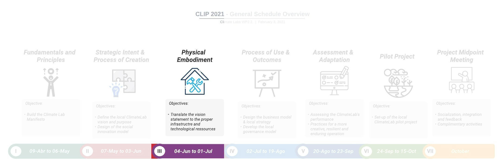

# Physical Embodiment {#sprint_3}

## Sprint Opening

```{r}

```

Welcome to the third sprint of the CLIP. In this sprint we are going to
focus on the **Physical Embodiment** of the Climate Labs.

::: {.infobox .goal data-latex="{.goal}"}
**GOAL**

The goal of the sprint 3 is:

> To translate the Climate Lab's vision into a **technological resource
> roadmap**
>
> *Sprint dates: **From May 28 to July 1 / 2021***
:::

A webinar will be held on **May 28** to officially launch the Sprint
III. It will be a synchronous session, so all CLT are expected to
attend. As usual, a series of content and activities are proposed to the
CLT to be completed during the course of the sprint:

1.  First, **three conceptual videos** are proposed to introduce the
    notion of technological resource management and, further, to have a
    wider view of the different manifestation of social innovation labs
    across the world.

2.  Second, **two case experiences** from members of the consortium are
    shared. This way we can learn a little more about the experience of
    each of our partners.

3.  Finally, you will find the link to the **team workshop** of this
    sprint. The workshop should be completed before the end of the
    sprint (**July 1**).

::: {.infobox .tip data-latex="{.assignment}"}
**NOTICE!**

The **full recording of the webinar** can be watched below.
:::

```{r}
knitr::include_url("https://www.youtube.com/embed/1iFji4RRLUg")
```

------------------------------------------------------------------------

## Conceptual Videos

### Background on Physical Embodiment

The materialization of an innovation lab itself encompasses all the
characteristics of the physical (or virtual) environment. The design of
the space varies significantly, with different design values and degrees
of flexibility; also, the way the space evolves needs to be
contemplated. Different innovation labs contain diverse levels of
physical resources, from IT infrastructure, support of prototyping and
visualization to the furniture. Each setup is realized based on specific
constraints such as resources, space, skills and time [@osorio2019]. In
this sense, one should always think about the physical embodiment of an
innovation lab in terms of its use, creation and intentions. This means
that a lab that seeks to foster teamwork should probably prioritize
flexible workspaces and social areas, while another that aims to
generate radical ideas may emphasize playfulness along with the
provision of multiple sources of inspiration [@Moultrie2007b;
@klooker2018].

The following are some of the aspects commonly considered to guide the
physical embodiment of innovation labs [@osorio2019; @Moultrie2007b]:

+----------------------+-----------------------------------------------+
| Criteria             | Description                                   |
+======================+===============================================+
| Geographic Location  | The physical location of the environment and  |
|                      | its relationship with the organization. This  |
|                      | can include the organization's own in-house   |
|                      | space up to external third-party facilities.  |
+----------------------+-----------------------------------------------+
| Scale                | The physical scale of the environment.        |
+----------------------+-----------------------------------------------+
| Real vs Virtual      | The degree to which the space is designed     |
|                      | around virtual teamwork and communication.    |
+----------------------+-----------------------------------------------+
| Flexibility          | The degree of flexibility of the space to     |
|                      | enable alternative configurations and uses.   |
|                      | The degree of flexibility/reconfigurability   |
|                      | of resources in the workspace.                |
+----------------------+-----------------------------------------------+
| Design Values        | Specific design values targeted at            |
|                      | encouraging specific behaviors. The use of    |
|                      | imagery to reinforce actions.                 |
+----------------------+-----------------------------------------------+
| IT Resources         | The role of IT to enable group work,          |
|                      | activities and processes.                     |
+----------------------+-----------------------------------------------+
| Data & Information   | The availability of local data/information to |
|                      | support innovation, creativity or design      |
|                      | processes/activities.                         |
+----------------------+-----------------------------------------------+
| Prototyping &        | Availability of equipment, facilities and     |
| Visualization        | tools to support modeling and visualization   |
|                      | activities as a core component of creative    |
|                      | and design processes.                         |
+----------------------+-----------------------------------------------+
| Constraints          | Practical constraints on the design of the    |
|                      | environment                                   |
+----------------------+-----------------------------------------------+
| Evolution            | The degree to which evolution is planned to   |
|                      | meet future goals.                            |
+----------------------+-----------------------------------------------+

: Physical Embodiment - Guiding set of criteria for Innovation Labs

### Why to develop a Technological Strategy for our Climate Labs? - Mauricio Camargo

```{r}
knitr::include_url("https://www.youtube.com/embed/piyG1Pau7f0")
```

Professor Mauricio Camargo from Université de Lorraine explains the
concept of Management of Technological Resources as a means to identify
the critical assets, capabilities and infrastructure for the
sustainability of the Climate Labs. This prospective approach is
instrumental in rapidly changing environments with a great deal of
uncertainty. To know more about this approach you can have a look to the
paper [@Boly2018; @Marche2017].

The Spanish version of this video can be accessed
[here](https://youtu.be/fwIT1j5CcqQ).

### Supporting Social Innovation across the world - Mark Anderson

```{r}
knitr::include_url("https://www.youtube.com/embed/1VyuRhzXLJg")
```

Mark Majewsky Anderson, Director of Research and Innovation at Glasgow
Caledonian University presents his perspective on social innovation in
the university context. He also shares his experience in promoting the
implementation of social support units in universities across Latin
America, Asia and Europe.

### Implementing Innovation Spaces: The case of Hotmilk at PUCPR - Fernando Luciano & André Turbay

```{r}
knitr::include_url("https://www.youtube.com/embed/hpQ1mMiRXVw")
```

In this video, Professor Fernando Luciano, Director of HotMilk the
Innovation Ecosystem at PUCPR, discusses the conditions, challenges and
concepts underlying the decision-making that led to the HotMilk space.
We present this experience as a way to contribute ideas and
possibilities for the ClimateLabs structures.

------------------------------------------------------------------------

## Case Experiences

### Ashoka Mexico -- Gabriela Carrasco

```{r, echo=FALSE}
knitr::include_url("https://www.youtube.com/embed/LBRmMsdUqBk")
```

Gabriela Carrasco from Ashoka Mexico presents the experience of the
Social Innovation Center at the Universidad de Aysén in the Chilean
Patagonia. This is one of the more than 40 university initiatives that
have participated in Ashoka Commons, a program to accelerate university
projects in social innovation.

### Instituto Tecnológico de Monterrey Campus Guadalajara -- Sebastián Gradilla y Diego Díaz

```{r}
knitr::include_url("https://www.youtube.com/embed/OLYeF9icR-k")
```

Professor Sebastián Gradilla and master's student Diego Díaz of the
Instituto Tecnológico de Monterrey Campus Guadalajara explain the role
of the Sustainability and Climate Change Laboratory in addressing the
challenges of agro-industrial waste management in the Jalisco region of
Mexico.

------------------------------------------------------------------------

## Team Workshop 4

Below you can find for each University the link to **workshop** for the
Sprint III:

## Colombia {.unnumbered}

-   Universidad de Caldas: [Workshop
    4](https://app.mural.co/t/climatelabs8815/m/climatelabs8815/1622129003173/1f5dcf74fee58c4f142239b7031a6837d32b4de4?sender=u28f60cfd9c32927225640992)

-   Universidad del Quindio: [Workshop
    4](https://app.mural.co/t/climatelabs8815/m/climatelabs8815/1622129080275/5ce7acbe40a2c1ef4262ba8a8daf399af9de3651?sender=u28f60cfd9c32927225640992)

-   Universidad de Manizales: [Workshop
    4](https://app.mural.co/t/climatelabs8815/m/climatelabs8815/1622129031612/e21fc03d671f2fa15423ace284a1f0d7e2884b56?sender=u28f60cfd9c32927225640992)

-   Universidad Tecnológica de Pereira: [Workshop
    4](https://app.mural.co/t/climatelabs8815/m/climatelabs8815/1622129090631/ca119901854733fae0c6ba331b93ba4e96ad480e?sender=u28f60cfd9c32927225640992)

-   Corporacion Universitaria Minuto de Dios: [Workshop
    4](https://app.mural.co/t/climatelabs8815/m/climatelabs8815/1622129064729/18ee47f2deb4105574090e30c3aa35b7ff014887?sender=u28f60cfd9c32927225640992)

## Mexico {.unnumbered}

-   Instituto Tecnológico y Estudios Superiores de Monterrey: [Workshop
    4](https://app.mural.co/t/climatelabs8815/m/climatelabs8815/1622127710168/98c6c2e2dfe6088a5057d31846af32935cc52bd1?sender=u28f60cfd9c32927225640992)

-   Universidad de Guadalajara: [Workshop
    4](https://app.mural.co/t/climatelabs8815/m/climatelabs8815/1622129016833/0139920c7c5cd7d75866efc2e6d1d989bcfe5342?sender=u28f60cfd9c32927225640992)

## Brazil {.unnumbered}

-   Pontifícia Universidade Católica do Rio Grande do Sul: [Workshop
    4](https://app.mural.co/t/climatelabs8815/m/climatelabs8815/1622128511508/75a0c49b00856046ebb805404613d73a7ee72e77?sender=u28f60cfd9c32927225640992)

-   Pontifícia Universidade Católica Do Paraná: [Workshop
    4](https://app.mural.co/t/climatelabs8815/m/climatelabs8815/1622128398832/df1b33fe852c991dba55e400f444bf216ff408b8?sender=u28f60cfd9c32927225640992)

-   Universidade Católica de Pernambuco: [Workshop
    4](https://app.mural.co/t/climatelabs8815/m/climatelabs8815/1622129050815/3a294c99c347df2419ceb1e84c04623709fd5553?sender=u28f60cfd9c32927225640992)

## Let us know your comments

In this section, you can put any comments/questions or share your
thoughts and feedback about this sprint. To insert new text, use the
"Edit" button.

<iframe width="100%" height="300" src="https://hackmd.io/@fabbiocrux/CLIP-sprint-I" frameborder="0">

</iframe>
