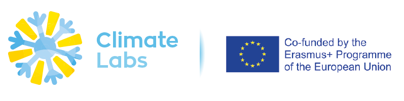
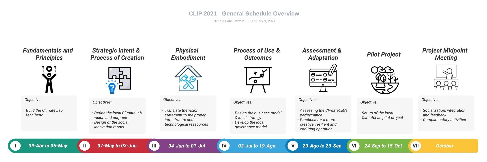

# Welcome to CLIP {.unnumbered}

```{r, include=FALSE}
knitr::opts_chunk$set(echo = FALSE, include = TRUE)
library(knitr)
#library(usethis)
#use_git_config(user.name = "foblike", user.email = "ferney.osorio-bustamante@univ-lorraine.fr")
```

The Université de Lorraine and the Pontifícia Universidade Católica do Paraná have led the design of the Climate Lab Incubation Program (CLIP). This program is intended to be a virtual space for sharing knowledge and experiences from the members of the Climate Lab consortium. The CLIP will serve as guidance and inspiration in the path of implementing the network of Climate Labs in Latin-American universities. The objective of this incubation program is to enable the Climate Lab Teams (CLT) to move forward in the design and implementation of their social innovation platform. Therefore, it is expected that all members of the CLT participate actively throughout the ensemble of the program.

| **Welcome to the first version of CLIP and please enjoy the design of your Climate Lab**

------------------------------------------------------------------------

{width="798"}

```{r CLIP,}
#
```

```{r include=FALSE}
# automatically create a bib database for R packages
knitr::write_bib(c(
  .packages(), 'bookdown', 'knitr', 'rmarkdown'
), 'packages.bib')
```
